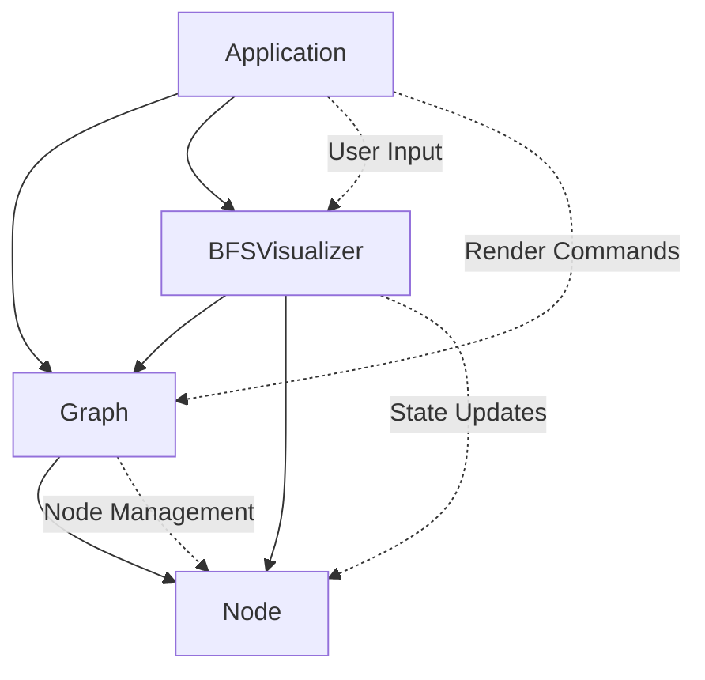

# BFS Visualizer

A real-time interactive visualization of the Breadth-First Search (BFS) algorithm implemented in C++ using SFML graphics library. This educational tool demonstrates how BFS traverses graphs by providing step-by-step visual feedback with an intuitive user interface.

## Features

- **Interactive BFS Visualization**: Click any node to start BFS traversal
- **Step-by-Step Control**: Manual stepping or auto-stepping with adjustable speed
- **Real-Time Queue Display**: Visual representation of the BFS queue
- **Dynamic Graph Generation**: Generate random connected graphs with collision-free node placement
- **Color-Coded States**: Visual distinction between unvisited, queued, current, and visited nodes
- **Comprehensive Controls**: Pause, resume, reset, and generate new graphs

## Algorithm Overview

### Breadth-First Search (BFS)

BFS explores graph nodes level by level, visiting all neighbors at the current depth before moving to the next depth level. This project visualizes the core BFS algorithm:

```cpp
1. Initialize queue with start node
2. Mark start node as visited
3. While queue is not empty:
   a. Dequeue front node (current node)
   b. Process current node
   c. Enqueue all unvisited neighbors
   d. Mark neighbors as visited
```

### Random Graph Generation

The project implements an intelligent graph generation algorithm:

1. **Collision-Free Placement**: Uses radial distribution with minimum distance constraints
2. **Connectivity Guarantee**: Creates a spanning tree to ensure all nodes are reachable
3. **Enhanced Structure**: Adds probability-based edges for interesting traversal patterns

## Architecture

The project follows a clean object-oriented design with clear separation of concerns:

### Core Classes

#### `Application`

- **Purpose**: Main application controller and event handler
- **Responsibilities**: Window management, user input processing, render loop coordination
- **Key Methods**: `run()`, `handleEvents()`, `update()`, `render()`

#### `Graph`

- **Purpose**: Graph data structure and rendering
- **Responsibilities**: Node/edge management, graph visualization, random graph generation
- **Key Methods**: `addNode()`, `addEdge()`, `generateSampleGraph()`, `draw()`
- **Algorithm**: Implements collision-free node placement and connected graph generation

#### `Node`

- **Purpose**: Individual graph vertex representation
- **Responsibilities**: State management, position handling, visual rendering
- **Key Features**: Color-coded states, neighbor tracking, click detection
- **States**: `UNVISITED`, `IN_QUEUE`, `CURRENT`, `VISITED`

#### `BFSVisualizer`

- **Purpose**: BFS algorithm implementation and visualization control
- **Responsibilities**: Algorithm execution, state management, visual feedback
- **Key Methods**: `startBFS()`, `step()`, `updateNodeStates()`
- **Algorithm**: Core BFS with visual state synchronization

### Class Interactions



## Controls

| Key             | Action                     |
| --------------- | -------------------------- |
| **Mouse Click** | Select start node for BFS  |
| **Space**       | Step through BFS algorithm |
| **P**           | Pause/Resume auto-stepping |
| **R**           | Reset current BFS          |
| **G**           | Generate new random graph  |
| **A**           | Toggle auto-stepping mode  |

## Visual Legend

- **⚪ White**: Unvisited nodes
- **🟡 Yellow**: Nodes in BFS queue
- **🔴 Red**: Current node being processed
- **🟢 Green**: Visited/completed nodes

## Building and Running

### Prerequisites

- C++17 compatible compiler
- SFML 3.0 or later
- CMake 3.16 or later

### Build Instructions

```bash
mkdir build && cd build
cmake ..
make
./BFS_Visualizer
```

### Dependencies

```cmake
find_package(SFML 3 COMPONENTS Window Graphics REQUIRED)
```

## Technical Implementation

### BFS State Machine

The visualizer implements a finite state machine with four states:

- `READY`: Waiting for user to select start node
- `RUNNING`: Actively executing BFS algorithm
- `PAUSED`: Algorithm paused, can be resumed
- `FINISHED`: BFS traversal completed

### Node State Synchronization

The system maintains consistent visual states through the `updateNodeStates()` method:

1. Resets all nodes to unvisited
2. Applies visited states from traversal history
3. Marks queued nodes from current BFS queue
4. Highlights current processing node

### Graph Generation Algorithm

```cpp
// Collision-free placement with radial distribution
for each node:
    attempts = 0
    while position_invalid and attempts < 100:
        generate_radial_position()
        check_minimum_distance_constraint()
        attempts++

// Ensure connectivity via spanning tree
for each unconnected_node:
    connect_to_nearest_connected_node()

// Add additional edges for complexity
for each node:
    probabilistically_connect_to_nearby_nodes()
```

## Educational Value

This project demonstrates several important computer science concepts:

- **Graph Theory**: Undirected graph representation and traversal
- **Algorithm Visualization**: Real-time algorithm execution display
- **Data Structures**: Queue implementation and graph adjacency lists
- **Software Architecture**: Clean separation of concerns and modular design
- **Interactive Systems**: Event-driven programming and user interface design

## Future Enhancements

- Depth-First Search (DFS) visualization
- Dijkstra's shortest path algorithm
- Graph loading/saving functionality
- Custom graph editing capabilities
- Performance metrics display

---

_Built with modern C++17 and SFML for cross-platform compatibility and smooth graphics performance._
